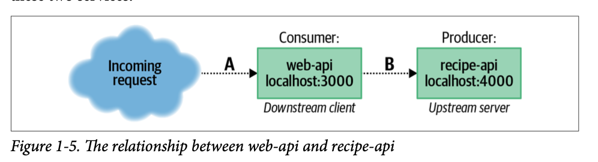

## Service Relationship

The web-api service is downstream of the recipe-api and, conversely, the
recipe-api is upstream of the web-api.

Both of these applications can be referred to as servers because they are both
actively listening for incoming network requests. However, when describing the
specific rela‐ tionship between the two APIs (arrow B in Figure 1-5), the
web-api can be referred to as the client/consumer and the recipe-api as the
server/producer. Chapter 2 focuses on this relationship. When referring to the
relationship between web browser and web-api (arrow A in Figure 1-5), the
browser is called the client/consumer, and web- api is then called the
server/producer.

In a real-world scenario, any shared files should be checked in via source
control or loaded as an outside dependency via an npm package.

The first line in these files is known as a shebang. When a file begins with
this line and is made executable (by running chmod +x filename.js), it can be
executed by running ./filename.js. As a convention in this book, any time code
contains a shebang, it rep‐ resents a file used as an entry point for an
application.
